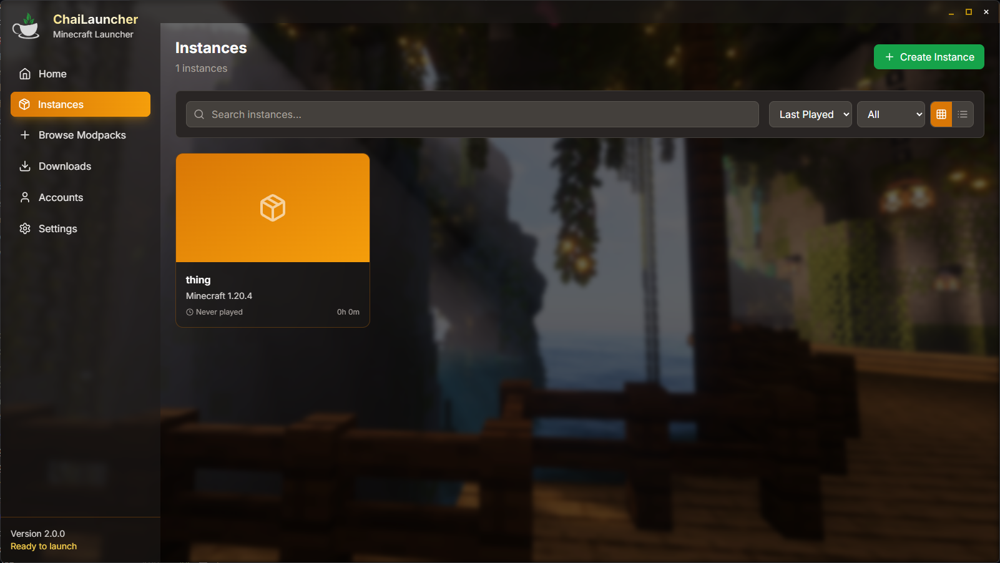
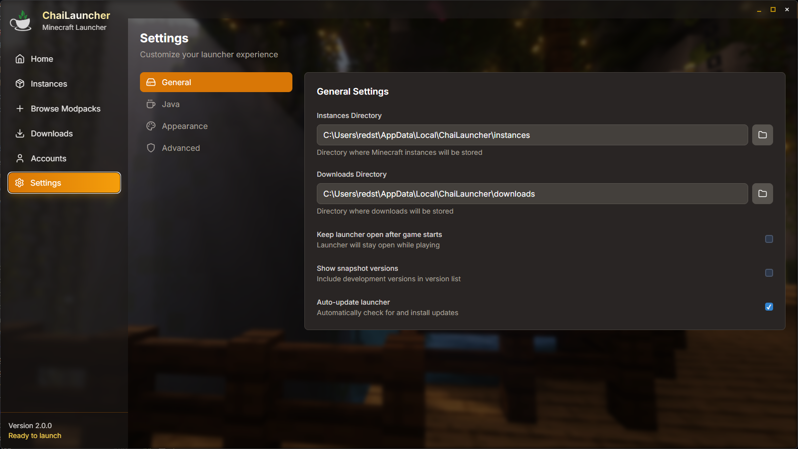

<p align="center">
  
</p>

# Modern Minecraft Launcher

*Inspired by GDLauncher, built with modern technologies*

<p align="">
  <a href="https://github.com/shield/ChaiLauncher">
    
  </a>
  <a href="LICENSE">
    
  </a>
  <a href="https://tauri.app/">
    
  </a>
  <a href="https://reactjs.org/">
    
  </a>
</p>

## ✨ Features

- 🎮 **Modern Interface** - Clean, intuitive UI built with React and Tailwind CSS
- ⚡ **Fast Performance** - Powered by Tauri for native performance
- 🔐 **Microsoft OAuth** - Secure Minecraft account integration
- 📦 **Mod Management (WIP)** - Easy installation and management of mods
- 🌐 **Cross-Platform** - Supports Windows, macOS, and Linux
- 📊 **Real-time Progress** - Visual feedback for downloads and installations

## 🚀 Quick Start

### Prerequisites

- [Node.js](https://nodejs.org/) (v16 or later)
- [Rust](https://www.rust-lang.org/tools/install) (latest stable)
- [Tauri CLI](https://tauri.app/v1/guides/getting-started/prerequisites)

### Installation

1. **Clone the repository**
   ```bash
   git clone https://github.com/tristanpoland/ChaiLauncher.git
   cd ChaiLauncher
   ```

2. **Install dependencies**
   ```bash
   npm install
   ```

3. **Run in development mode**
   ```bash
   npm run tauri:dev
   ```

4. **Build for production**
   ```bash
   npm run tauri:build
   ```

## 🛠️ Technology Stack

<div align="center">

| Frontend | Backend | Tools |
|----------|---------|-------|
|  |  |  |
|  |  |  |

</div>

### Core Dependencies

- **Frontend**: React 18, Tailwind CSS, Framer Motion, Radix UI
- **Backend**: Tauri 2.8, Tokio, Reqwest, OAuth2
- **Build Tools**: Vite, TypeScript, PostCSS

## 📱 Screenshots








## 🤝 Contributing

We welcome contributions from the community! Here's how you can help:

1. **Fork** the repository
2. **Create** a feature branch (`git checkout -b feature/amazing-feature`)
3. **Commit** your changes (`git commit -m 'Add some amazing feature'`)
4. **Push** to the branch (`git push origin feature/amazing-feature`)
5. **Open** a Pull Request

### Development Guidelines

- Follow the existing code style and conventions
- Write clear, descriptive commit messages
- Test your changes thoroughly
- Update documentation as needed

## 📋 Roadmap

- [ ] Advanced mod management features
- [ ] Multiple Minecraft version support
- [ ] Custom modpack creation
- [ ] Server browser integration
- [ ] Shader pack management
- [ ] Resource pack management
- [ ] Performance optimization tools

## 🐛 Bug Reports & Feature Requests

Found a bug or have a feature request? Please open an issue on our [GitHub Issues](https://github.com/tristanpoland/ChaiLauncher/issues) page.

## 📄 License

This project is licensed under the MIT License - see the [LICENSE](LICENSE) file for details.

---

<div align="center">
  <p>Made with ❤️ by the ChaiLauncher Team</p>
  <p>
    <a href="https://github.com/tristanpoland/ChaiLauncher">⭐ Star this repo</a> |
    <a href="https://github.com/tristanpoland/ChaiLauncher/issues">🐛 Report Bug</a> |
    <a href="https://github.com/tristanpoland/ChaiLauncher/issues">💡 Request Feature</a>
  </p>
</div>
